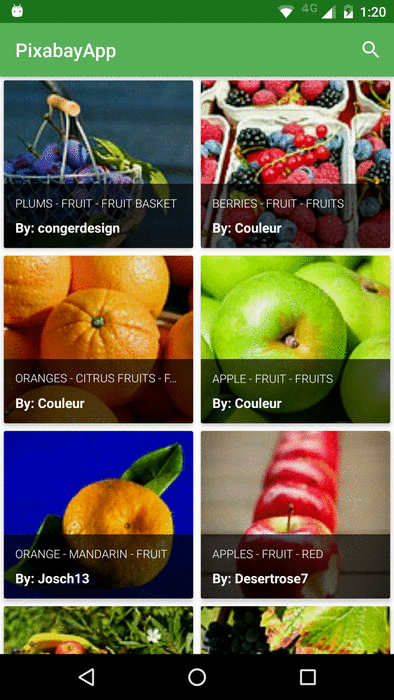

# PixaBay Image Viewer 
An app that consumes the [PixaBay API](https://pixabay.com/api/docs/) and enables the user to look for images. 

## Getting started
Clone the repository and import the project in Android Studio, you can try the app installing the [`pixabayApp.apk`](https://github.com/gkaffka/pixabayapp/blob/master/pixabayApp.apk) available in the project root.
You will also need to provide a key to access the Pixabay API, after getting the key, just put it in the `string.xml` file in the place of `YOUR_API_KEY_HERE`

## Dependencies
The depdendencies for the project are described in the Gradle script `build.gradle` of the app, just sync the project in Android Studio and you are ready to go :)

List of third party libraries used in the project so far
- [Retrofit/OKhttp](http://square.github.io/retrofit/) - A type-safe REST client for Android and Java
- [Gson](https://github.com/google/gson) - Gson is a Java library that can be used to convert Java Objects into their JSON representation.
- [Glide](https://github.com/bumptech/glide) - A fast and efficient open source media management and image loading framework for Android
- [PhotoView](https://github.com/chrisbanes/PhotoView) - An easily usable implementation of a zooming Android ImageView.
- [JUnit4](http://junit.org/junit4/) - JUnit is a simple framework to write repeatable tests. 
- [Espresso](https://developer.android.com/training/testing/ui-testing/espresso-testing.html) - Espresso provides APIs for writing UI tests to simulate user interactions within a single target app.

## Running it
You can [build and run](https://developer.android.com/tools/building/building-studio.html) the project using the Android Studio/Gradle. You need an [android emulator](http://developer.android.com/tools/devices/emulator.html) or a [real device](http://developer.android.com/tools/device.html) to test the build.

## Screenshots

